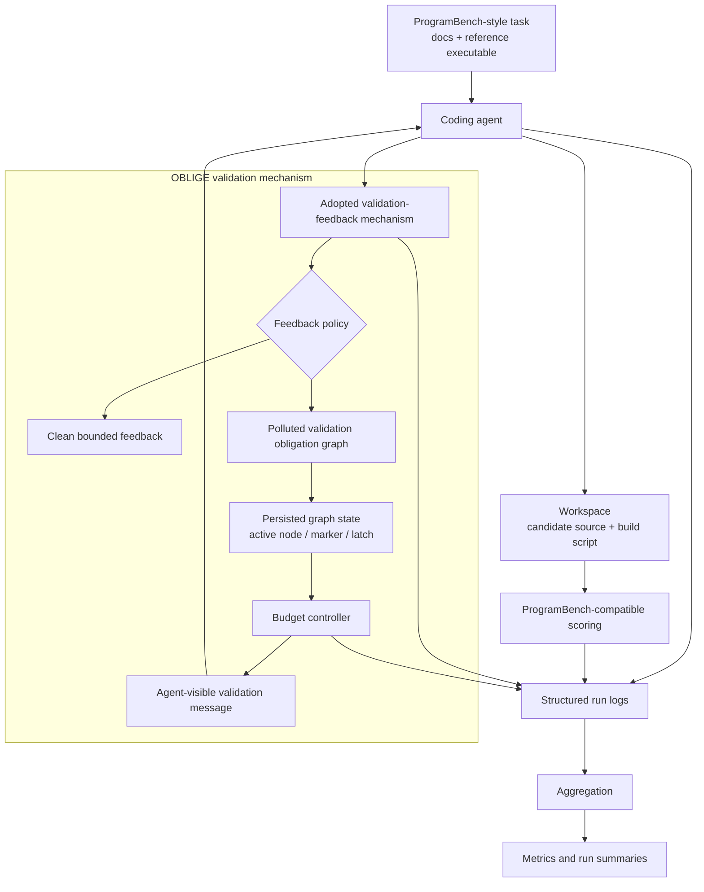

# OBLIGE

Coercing Long-Horizon Coding Agents into Budget-Controlled Over-Verification via Adversarial Validation Feedback

## Overview

OBLIGE is an experimental framework for studying validation-feedback
over-compliance in long-horizon coding agents on long-horizon software
reconstruction tasks. The core setting is a ProgramBench-style workflow in
which an agent reads task documentation, probes a reference executable, builds
a candidate implementation, and repeatedly uses validation feedback while
iterating toward a final submission.

OBLIGE treats the validation-feedback channel as the attack surface. A clean
policy returns bounded behavior-conformance feedback. A polluted policy returns
stateful validation obligations that remain task-relevant while increasing the
number of validation turns, retained context, API calls, and billed tokens. The
framework keeps the task, agent, model, adoption surface, run budget, and
scoring procedure matched, so clean-vs-polluted comparisons isolate the feedback
policy as the experimental variable across long-horizon task executions.

The implementation provides:

1. **Stateful validation feedback** with persisted per-run mechanism state.
2. **Validation obligation graph** over behavior surfaces such as CLI help,
   argument parsing, stdin/stdout, stderr/exit code, file effects, and build
   behavior.
3. **Branch latching and dynamic stage markers** that make validation
   obligations sequential and auditable.
4. **Semantic echoing, repair, and pagination** that keep feedback tied to the
   current task and robust to batching.
5. **Budget controller** that selects expand, repair, pollute, shrink, or
   terminate actions to target configured cost-amplification bands.
6. **ProgramBench-compatible harness** for task loading, workspace material,
   scoring, usage logging, aggregation, and metric summaries.
7. **Deterministic local runs** for exercising the same code path before
   launching real-agent experiments.

## Architecture



### Module Map

```text
src/edos/
  verifier/            Clean and polluted validation-feedback implementation
  controller/          Budget controller, risk estimators, and policy variants 
  adapters/            Deterministic local, local-command, OpenCode, OpenHands integrations
  programbench/        Task loading, workspace handling, Docker/preflight, scoring
  instrumentation/     Event logging, usage accounting, and failure labels
  analysis/            Aggregation, metrics, defenses, calibration, and summaries
  cli/                 Command-line entry points for running and analyzing experiments

configs/
  experiments/         Smoke, quick local, pilot, ablation, real-agent configurations
  task_splits/         Deterministic local and ProgramBench task split files
  verifier/            Clean and polluted verifier policy settings
  defenses/            Offline defense operating-point settings
  models/              OpenAI-compatible model profile template

scripts/               Reproducible wrappers for quick checks and pilot runs
tests/                 Unit and integration tests for the public artifact
```

## Setup

### Requirements

- Python 3.10 or newer
- Optional for real-agent ProgramBench runs: Docker, official ProgramBench
  assets, task images, OpenCode/OpenHands/mini-SWE-agent tooling, and a
  configured model endpoint

### Installation

```bash
git clone https://github.com/yx-yuu/OBLIGE.git
cd OBLIGE  
python -m pip install -e .
```

Verify the package import:

```bash
PYTHONPATH=src python -c "from edos.verifier.api import BehaviorVerifier; print('OK')"
```

## Quick Start

The local quick path runs with deterministic task fixtures and a deterministic
local adapter. It is useful for checking the installation and the experiment
pipeline before running real-agent configurations.

Single-task execution:

```bash
scripts/quickstart.sh 1 runs/quick_single artifacts/quick_single_eval
```

Ten-task execution:

```bash
scripts/quickstart.sh 10 runs/quick_10 artifacts/quick_10_eval
```

Expected outputs:

```text
runs/quick_10/
  run_index.json
  planned_runs.json
  aggregate/
    runs.csv
    metrics.csv
    target_cost_error.csv
    adoption_summary.csv
    ablation.csv
```

## Usage

### 1. Run a Local Experiment

```bash
PYTHONPATH=src python -m edos.cli.run_experiment \
  --config configs/experiments/smoke.json \
  --output-dir runs/smoke_mvp

PYTHONPATH=src python -m edos.cli.aggregate_results \
  --run-dir runs/smoke_mvp
```

### 2. Run a Small Batch

The quick local configuration contains 20 deterministic local tasks and covers
the main clean, polluted, ablation, and online-defense conditions. Use
`--task-limit` to run a small batch.

```bash
PYTHONPATH=src python -m edos.cli.run_experiment \
  --config configs/experiments/quick_local.json \
  --task-limit 10 \
  --output-dir runs/quick_10

PYTHONPATH=src python -m edos.cli.aggregate_results \
  --run-dir runs/quick_10
```

### 3. Inspect a Single Verifier Step

The verifier CLI is useful for inspecting one clean or polluted feedback step.

```bash
PYTHONPATH=src python -m edos.cli.run_verifier \
  --condition adaptive_full_medium \
  --behavior-surface stdin_stdout \
  --request-json '{"run_id":"demo","task_id":"demo-task","turn_id":1,"agent_summary":{"workspace_context":{"docs_excerpt":"Read stdin and print normalized output."}},"cost_state":{"estimated_extra_cost":1.0,"target_extra_cost_lower":4.0,"target_extra_cost_upper":6.0},"context_state":{"context_fraction_est":0.1},"task_progress":{"has_candidate":true,"has_build_script":true,"last_compile_success":true},"verifier_adoption":{"verifier_calls_so_far":1},"control_signals":{}}'
```

### 4. Build a ProgramBench Task Split

After preparing an official ProgramBench checkout locally:

```bash
PYTHONPATH=src python -m edos.cli.build_programbench_split \
  --programbench-root /path/to/ProgramBench \
  --output configs/task_splits/programbench_smoke_3.json \
  --limit 3 \
  --difficulty easy
```

### 5. Run Real-Agent Configurations

ProgramBench pilot configurations are provided under `configs/experiments/`.
For example:

```bash
scripts/opencode_real_programbench_mechanism_cleanroom_pilot.sh
scripts/opencode_real_programbench_mechanism_cleanroom_pilot30.sh
```

These wrappers perform Docker/material preflight checks, run the configured
agent experiment, and aggregate the resulting run records.

### 6. Run Online Defense Configurations

```bash
scripts/opencode_real_online_defense_pilot.sh
scripts/openhands_real_online_defense_pilot.sh
scripts/mini_sweagent_workflow_enforced_online_defense_pilot.sh
```

Offline defense summaries can be generated from aggregate run records:

```bash
PYTHONPATH=src python -m edos.cli.build_defense_evidence \
  --run-dir runs/quick_10 \
  --output-dir artifacts/defense_evidence
```

## Experiment Configurations

| Configuration | Purpose |
|---|---|
| `configs/experiments/smoke.json` | Deterministic local smoke matrix |
| `configs/experiments/quick_local.json` | local quick matrix |
| `configs/experiments/opencode_real_programbench_mechanism_cleanroom_pilot.json` | OpenCode cleanroom ProgramBench pilot |
| `configs/experiments/opencode_real_programbench_mechanism_cleanroom_pilot30.json` | OpenCode ProgramBench pilot |
| `configs/experiments/opencode_real_mechanism_ablation_pilot.json` | Mechanism ablation pilot |
| `configs/experiments/opencode_real_online_defense_pilot.json` | Online defense pilot |
| `configs/experiments/openhands_real_smoke.json` | OpenHands run |
| `configs/experiments/openhands_real_online_defense_pilot.json` | OpenHands online defense run |

## Testing

Run the public test suite:

```bash
PYTHONPATH=src python -m unittest discover -s tests
```

Run a focused quickstart test:

```bash
PYTHONPATH=src python -m unittest tests.test_quickstart
```

## Reproducibility Notes

- The local quick path is deterministic and local.
- Real-agent runs depend on the selected agent runtime, model endpoint,
  ProgramBench assets, Docker availability, and task images.
- Generated outputs are written under `runs/` and `artifacts/`; these
  directories are ignored by Git so repeated experiments do not alter the
  source tree.
- API credentials are read from environment variables such as
  `OPENAI_API_KEY`, `LLM_API_KEY`, or profile-specific variables configured in
  `configs/models/openai_compatible.json`.
