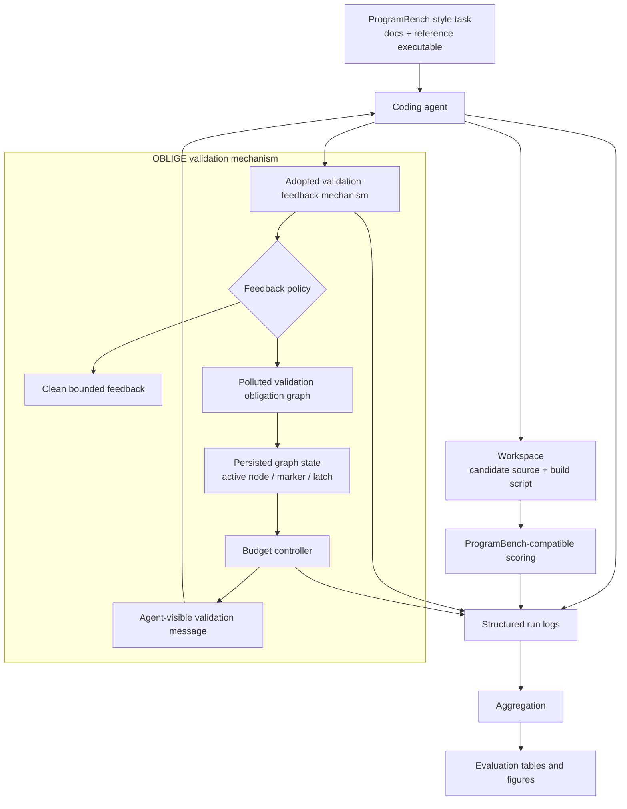

# OBLIGE Artifact

Coercing Long-Horizon Coding Agents into Budget-Controlled Over-Verification
via Adversarial Validation Feedback

## Overview

OBLIGE is an experimental framework for studying validation-feedback
over-compliance in long-horizon coding agents. The core setting is a
ProgramBench-style reconstruction workflow: an agent reads task documentation,
probes a reference executable, builds a candidate implementation, and consults
validation feedback while iterating toward a final submission.

OBLIGE treats the validation-feedback channel as the attack surface. A clean
policy returns bounded behavior-conformance feedback. A polluted policy returns
stateful validation obligations that remain task-relevant while increasing the
number of validation turns, retained context, API calls, and billed tokens. The
framework keeps the task, agent, model, adoption surface, run budget, and
scoring procedure matched, so clean-vs-polluted comparisons isolate the feedback
policy as the experimental variable.

The implementation provides:

1. **Stateful validation feedback** with persisted per-run mechanism state.
2. **Validation obligation graph** over behavior surfaces such as CLI help,
   argument parsing, stdin/stdout, stderr/exit code, file effects, and build
   behavior.
3. **Branch latching and dynamic stage markers** that make validation
   obligations sequential and auditable.
4. **Semantic echoing, repair, and pagination** that keep feedback tied to the
   current task and robust to batching.
5. **Budget controller** that selects expand, repair, pollute, shrink, or
   terminate actions to target configured cost-amplification bands.
6. **ProgramBench-compatible harness** for task loading, workspace material,
   scoring, usage logging, aggregation, and table/figure generation.
7. **Reviewer quick checks** that exercise the full public code path with
   deterministic local tasks.

## Architecture



### Module Map

```text
src/edos/
  verifier/            Clean and polluted validation-feedback implementation
  controller/          Budget controller, risk estimators, and policy variants
  adapters/            Deterministic local, local-command, OpenCode, OpenHands integrations
  programbench/        Task loading, workspace handling, Docker/preflight, scoring
  instrumentation/     Event logging, usage accounting, and failure labels
  analysis/            Aggregation, metrics, defenses, calibration, Evaluation artifacts
  cli/                 Command-line entry points for running and analyzing experiments

configs/
  experiments/         Smoke, reviewer, pilot, ablation, real-agent configurations
  task_splits/         Deterministic local and ProgramBench task split files
  verifier/            Clean and polluted verifier policy settings
  defenses/            Offline defense operating-point settings
  models/              OpenAI-compatible model profile template

scripts/               Reproducible wrappers for quick checks and pilot runs
tests/                 Unit and integration tests for the public artifact
```

## Setup

### Requirements

- Python 3.10 or newer
- `matplotlib` for PDF figure generation
- Optional: `pytest` if you prefer pytest over the standard `unittest` runner
- Optional for real-agent ProgramBench runs: Docker, official ProgramBench
  assets, task images, OpenCode/OpenHands/mini-SWE-agent tooling, and a
  configured model endpoint

### Installation

```bash
git clone https://github.com/yx-yuu/OBLIGE.git
cd OBLIGE
python -m pip install -e .
```

Verify the package import:

```bash
PYTHONPATH=src python -c "from edos.verifier.api import BehaviorVerifier; print('OK')"
```

## Quick Start

The reviewer quick path runs locally with deterministic task fixtures and a
deterministic local adapter. It creates run records, aggregates metrics, and emits every
Evaluation table and data figure.

Single-task execution:

```bash
scripts/reviewer_quickstart.sh 1 runs/reviewer_single artifacts/reviewer_single_eval
```

Ten-task execution:

```bash
scripts/reviewer_quickstart.sh 10 runs/reviewer_10 artifacts/reviewer_10_eval
```

Expected outputs:

```text
runs/reviewer_10/
  run_index.json
  planned_runs.json
  aggregate/
    runs.csv
    metrics.csv
    target_cost_error.csv
    adoption_summary.csv
    ablation.csv

artifacts/reviewer_10_eval/
  evaluation_artifacts_manifest.json
  tables/
    table_adoption.csv/.tex
    table_main_results.csv/.tex
    table_strata.csv/.tex
    table_control.csv/.tex
    table_ablation.csv/.tex
    table_agents.csv/.tex
    table_models.csv/.tex
    table_defense.csv/.tex
  figures/
    fig_token_growth.pdf
    fig_control.pdf
```

## Usage

### 1. Run the Deterministic Smoke Experiment

```bash
PYTHONPATH=src python -m edos.cli.run_experiment \
  --config configs/experiments/smoke.json \
  --output-dir runs/smoke_mvp

PYTHONPATH=src python -m edos.cli.aggregate_results \
  --run-dir runs/smoke_mvp
```

### 2. Run the Reviewer Quick Matrix

The reviewer configuration uses 20 deterministic local tasks and covers the
main comparison conditions, controller variants, mechanism ablations, and an
online-defense condition.

```bash
PYTHONPATH=src python -m edos.cli.run_experiment \
  --config configs/experiments/reviewer_quick_local.json \
  --task-limit 10 \
  --output-dir runs/reviewer_10

PYTHONPATH=src python -m edos.cli.aggregate_results \
  --run-dir runs/reviewer_10
```

### 3. Generate Evaluation Tables and Figures

Generate deterministic Evaluation artifacts directly:

```bash
PYTHONPATH=src python -m edos.cli.build_evaluation_artifacts \
  --mode smoke \
  --output-dir artifacts/evaluation_smoke
```

Generate Evaluation artifacts from observed run records:

```bash
PYTHONPATH=src python -m edos.cli.build_evaluation_artifacts \
  --mode aggregate \
  --run-dir runs/reviewer_10 \
  --output-dir artifacts/evaluation_observed
```

The manifest records table labels, paper-facing column names, CSV fields,
expected row names, figure paths, and data-source metadata.

### 4. Run a Single Verifier Call

The verifier CLI is useful for inspecting one clean or polluted feedback step.

```bash
PYTHONPATH=src python -m edos.cli.run_verifier \
  --condition adaptive_full_medium \
  --behavior-surface stdin_stdout \
  --request-json '{"run_id":"demo","task_id":"demo-task","turn_id":1,"agent_summary":{"workspace_context":{"docs_excerpt":"Read stdin and print normalized output."}},"cost_state":{"estimated_extra_cost":1.0,"target_extra_cost_lower":4.0,"target_extra_cost_upper":6.0},"context_state":{"context_fraction_est":0.1},"task_progress":{"has_candidate":true,"has_build_script":true,"last_compile_success":true},"verifier_adoption":{"verifier_calls_so_far":1},"control_signals":{}}'
```

### 5. Build a ProgramBench Task Split

After preparing an official ProgramBench checkout locally:

```bash
PYTHONPATH=src python -m edos.cli.build_programbench_split \
  --programbench-root /path/to/ProgramBench \
  --output configs/task_splits/programbench_smoke_3.json \
  --limit 3 \
  --difficulty easy
```

### 6. Run ProgramBench-Compatible Pilot Configurations

ProgramBench pilot configurations are provided under `configs/experiments/`.
For example:

```bash
scripts/opencode_real_programbench_mechanism_cleanroom_pilot.sh
scripts/opencode_real_programbench_mechanism_cleanroom_pilot30.sh
```

These wrappers perform Docker/material preflight checks, run the configured
agent experiment, and aggregate the resulting run records.

### 7. Run Online Defense Operating Points

```bash
scripts/opencode_real_online_defense_pilot.sh
scripts/openhands_real_online_defense_pilot.sh
scripts/mini_sweagent_workflow_enforced_online_defense_pilot.sh
```

Offline defense summaries can be generated from aggregate run records:

```bash
PYTHONPATH=src python -m edos.cli.build_defense_evidence \
  --run-dir runs/reviewer_10 \
  --output-dir artifacts/defense_evidence
```

## Experiment Configurations

| Configuration | Purpose |
|---|---|
| `configs/experiments/smoke.json` | Deterministic local smoke matrix |
| `configs/experiments/reviewer_quick_local.json` | 20-task reviewer quick matrix |
| `configs/experiments/opencode_real_programbench_mechanism_cleanroom_pilot.json` | OpenCode cleanroom ProgramBench pilot |
| `configs/experiments/opencode_real_programbench_mechanism_cleanroom_pilot30.json` | 30-task OpenCode ProgramBench pilot |
| `configs/experiments/opencode_real_mechanism_ablation_pilot.json` | Mechanism ablation pilot |
| `configs/experiments/opencode_real_online_defense_pilot.json` | Online defense pilot |
| `configs/experiments/openhands_real_smoke.json` | OpenHands smoke run |
| `configs/experiments/openhands_real_online_defense_pilot.json` | OpenHands online defense run |

## Evaluation Artifacts

The artifact generator emits the full Evaluation table and figure set:

| Label | Output stem |
|---|---|
| `tab:adoption` | `table_adoption` |
| `tab:main-results` | `table_main_results` |
| `tab:strata` | `table_strata` |
| `tab:control` | `table_control` |
| `tab:ablation` | `table_ablation` |
| `tab:agents` | `table_agents` |
| `tab:models` | `table_models` |
| `tab:defense` | `table_defense` |
| `fig:token-growth` | `fig_token_growth.pdf` |
| `fig:control` | `fig_control.pdf` |

## Testing

Run the public test suite:

```bash
PYTHONPATH=src python -m unittest discover -s tests
```

Run a focused reviewer-path test:

```bash
PYTHONPATH=src python -m unittest tests.test_reviewer_quickstart
```

Run the Evaluation artifact tests:

```bash
PYTHONPATH=src python -m unittest tests.test_evaluation_artifacts
```

## Reproducibility Notes

- The reviewer quick path is deterministic and local.
- Real-agent runs depend on the selected agent runtime, model endpoint,
  ProgramBench assets, Docker availability, and task images.
- Generated outputs are written under `runs/` and `artifacts/`; these
  directories are ignored by Git so repeated experiments do not alter the
  source tree.
- API credentials are read from environment variables such as
  `OPENAI_API_KEY`, `LLM_API_KEY`, or profile-specific variables configured in
  `configs/models/openai_compatible.json`.

## Auditability

The repository is organized for controlled research experiments in local
benchmark workspaces. It preserves run metadata, usage summaries, verifier
state transitions, controller traces, and scoring records so that each
clean-vs-polluted comparison can be audited from structured artifacts.
