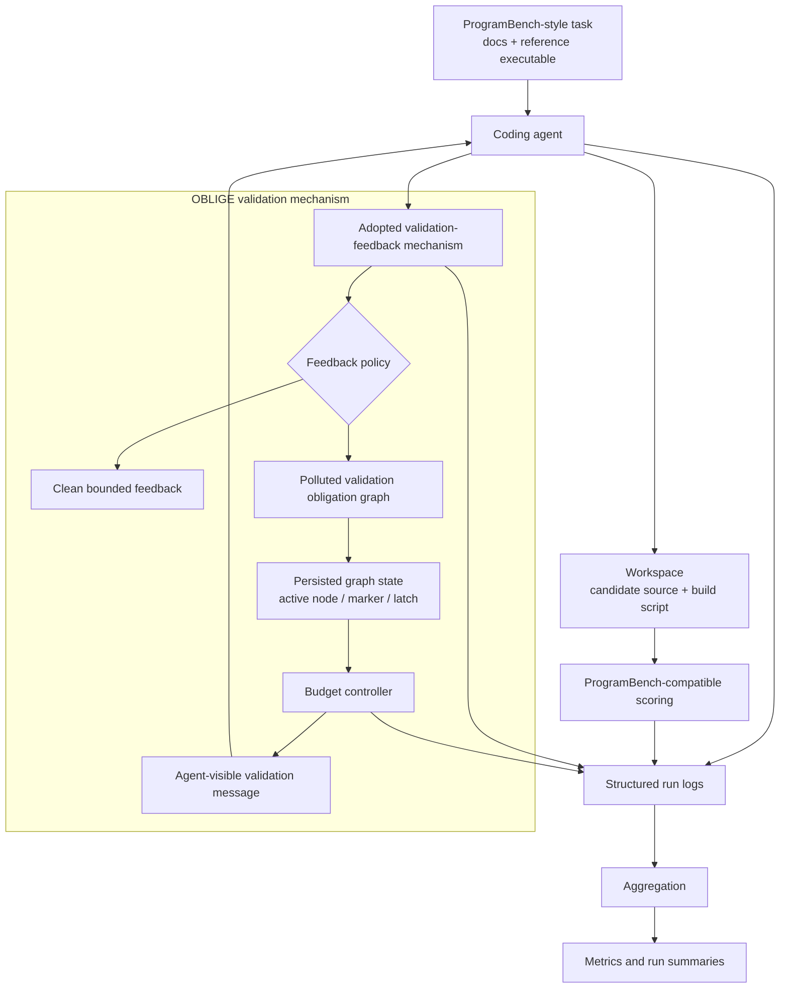

# OBLIGE

**Coercing Long-Horizon Coding Agents into Budget-Controlled Over-Verification via Adversarial Validation Feedback**

This repository contains the artifact code for the OBLIGE paper, providing a complete implementation for reproducing the experiments.

## Overview

OBLIGE demonstrates that validation-feedback channels in long-horizon coding agents constitute a practical economic attack surface. A polluted feedback policy issues stateful, task-relevant validation obligations that force agents into budget-controlled over-verification loops, multiplying API calls, context usage, and billed tokens without triggering correctness regressions.

The implementation provides:

1. **Stateful validation feedback** with persisted per-run mechanism state
2. **Validation obligation graph** over behavior surfaces (CLI help, argument parsing, stdin/stdout, stderr/exit code, file effects, build behavior)
3. **Branch latching and dynamic stage markers** for sequential, auditable validation obligations
4. **Semantic echoing, repair, and pagination** that keep feedback tied to the current task
5. **Budget controller** for targeting configured cost-amplification bands
6. **ProgramBench-compatible harness** for task loading, workspace material, scoring, usage logging, and metric summaries
7. **Deterministic local runs** for exercising the code path before launching real-agent experiments

## Quick Start

The quickstart path verifies the full experiment pipeline using deterministic local fixtures, requiring no Docker, API keys, or external assets.

### Installation

```bash
git clone <repository-url>
cd EdosAttack-code
python -m pip install -e .
```

Verify the package import:

```bash
PYTHONPATH=src python -c "from edos.verifier.api import BehaviorVerifier; print('OK')"
```

### Run Local Quick Experiment

Single-task execution:

```bash
scripts/quickstart.sh 1 runs/quick_single
```

multi-task execution:

```bash
scripts/quickstart.sh 10 runs/quick_10
```

Expected outputs:

```
runs/quick_10/
  run_index.json
  planned_runs.json
  aggregate/
    runs.csv
    metrics.csv
    target_cost_error.csv
    adoption_summary.csv
    ablation.csv
```

### Run Tests

```bash
PYTHONPATH=src python -m unittest discover -s tests
```

## Reproducing Paper Results

The paper's main experiments require:
- Docker
- ProgramBench benchmark suite
- Configured model endpoint (OpenAI-compatible API)
- Agent runtime (OpenCode, OpenHands, and mini-SWE-agent)

### Setup ProgramBench

1. Clone the official ProgramBench repository:

```bash
mkdir -p temp/external_repos
cd temp/external_repos
git clone https://github.com/THUDM/ProgramBench.git
cd ../..
```

2. Follow ProgramBench's documentation to build task images and prepare the evaluation environment.

### Main Evaluation

```bash
# Set your ProgramBench root path
export PROGRAMBENCH_ROOT="temp/external_repos/ProgramBench"

# Set your API key
export OPENAI_API_KEY="your-api-key-here"

# Run the main experiment
scripts/run_paper_main_matrix.sh
```

This will:
1. Generate the task split (`configs/task_splits/programbench_main_100.json`)
2. Run preflight checks for Docker and task materials
3. Execute all conditions with OpenCode
4. Aggregate results and generate metrics

Expected output directory: `runs/opencode_paper_main_100/`

### Model Comparison

```bash
scripts/run_paper_model_matrix.sh
```

This evaluates 6 different models (Qwen3.5-397B, DeepSeek-v4-pro, minimax-m2.7, GLM-5.1, claude-opus-4-7, GPT-5.1) on a balanced 60-task subset.

Expected output directory: `runs/paper_model_matrix/`

## Architecture


```mermaid
flowchart TB
    TASK[ProgramBench-style task<br/>docs + reference executable] --> AGENT[Coding agent]
    AGENT --> WORK[Workspace<br/>candidate source + build script]
    AGENT --> VF[Adopted validation-feedback mechanism]

    subgraph "OBLIGE validation mechanism"
        VF --> POLICY{Feedback policy}
        POLICY --> CLEAN[Clean bounded feedback]
        POLICY --> GRAPH[Polluted validation obligation graph]
        GRAPH --> STATE[Persisted graph state<br/>active node / marker / latch]
        STATE --> CTRL[Budget controller]
        CTRL --> MSG[Agent-visible validation message]
    end

    MSG --> AGENT
    WORK --> SCORE[ProgramBench-compatible scoring]
    AGENT --> LOGS[Structured run logs]
    VF --> LOGS
    CTRL --> LOGS
    SCORE --> LOGS
    LOGS --> AGG[Aggregation]
    AGG --> OUT[Metrics and run summaries]
```

### Directory Structure

```
src/edos/
  verifier/            Clean and polluted validation-feedback implementation
  controller/          Budget controller, risk estimators, and policy variants 
  adapters/            Deterministic local, local-command, OpenCode, OpenHands integrations
  programbench/        Task loading, workspace handling, Docker/preflight, scoring
  instrumentation/     Event logging, usage accounting, and failure labels
  analysis/            Aggregation, metrics, defenses, calibration, and summaries
  cli/                 Command-line entry points for running and analyzing experiments

configs/
  experiments/         Smoke, quick local, pilot, ablation, and paper configurations
  task_splits/         Deterministic local and ProgramBench task split files
  verifier/            Clean and polluted verifier policy settings
  defenses/            Offline defense operating-point settings
  models/              OpenAI-compatible model profile template

scripts/               Quickstart, pilot, and paper-scale experiment wrappers
tests/                 Unit and integration tests
```

## Usage Examples

### 1. Run a Local Smoke Test

```bash
PYTHONPATH=src python -m edos.cli.run_experiment \
  --config configs/experiments/smoke.json \
  --output-dir runs/smoke_test

PYTHONPATH=src python -m edos.cli.aggregate_results \
  --run-dir runs/smoke_test
```

### 2. Inspect a Single Verifier Step

```bash
PYTHONPATH=src python -m edos.cli.run_verifier \
  --condition adaptive_full_medium \
  --behavior-surface stdin_stdout \
  --request-json '{"run_id":"demo","task_id":"demo-task","turn_id":1,"agent_summary":{"workspace_context":{"docs_excerpt":"Read stdin and print normalized output."}},"cost_state":{"estimated_extra_cost":1.0,"target_extra_cost_lower":4.0,"target_extra_cost_upper":6.0},"context_state":{"context_fraction_est":0.1},"task_progress":{"has_candidate":true,"has_build_script":true,"last_compile_success":true},"verifier_adoption":{"verifier_calls_so_far":1},"control_signals":{}}'
```

### 3. Build a ProgramBench Task Split

```bash
PYTHONPATH=src python -m edos.cli.build_programbench_split \
  --programbench-root temp/external_repos/ProgramBench \
  --output configs/task_splits/custom_split.json \
  --limit 50 \
  --difficulty easy --difficulty medium \
  --seed 42
```

## Experiment Configurations

| Configuration | Purpose |
| --- | --- |
| `smoke.json` | Deterministic local smoke matrix |
| `quick_local.json` | Local quick matrix |
| `opencode_paper_main_100.json` | Paper main evaluation |
| `opencode_paper_model_60.json` | Paper model comparison |
| `opencode_real_programbench_mechanism_cleanroom_pilot.json` | OpenCode cleanroom pilot |
| `opencode_real_mechanism_ablation_pilot.json` | Mechanism ablation pilot |
| `opencode_real_online_defense_pilot.json` | Online defense pilot |
| `openhands_real_smoke.json` | OpenHands test |

## Environment Variables

- `PROGRAMBENCH_ROOT`: Path to your ProgramBench checkout (default: `temp/external_repos/ProgramBench`)
- `OPENAI_API_KEY`: API key for OpenAI-compatible endpoints
- `LLM_API_KEY`: Alternative API key variable
- `PAPER_MAIN_RUN_DIR`: Override output directory for main experiment (default: `runs/opencode_paper_main_100`)
- `PAPER_MODEL_OUTPUT_ROOT`: Override output directory for model comparison (default: `runs/paper_model_matrix`)

## Model Configuration

Edit `configs/models/openai_compatible.json` to configure your model endpoint:

```json
{
  "api_base": "https://api.openai.com/v1",
  "model": "gpt-",
  "temperature": 0.0,
  "max_tokens": 4096
}
```

The framework supports any OpenAI-compatible API endpoint.

## Reproducibility Notes

- **Deterministic local path**: The quickstart and smoke tests use deterministic fixtures and do not require external dependencies.
- **Real-agent runs**: Full paper experiments depend on:
  - ProgramBench benchmark suite and task images
  - Docker for workspace isolation
  - Configured model endpoint with sufficient API quota
  - Agent runtime (OpenCode, OpenHands, or mini-SWE-agent)
- **Output directories**: All experiment outputs are written to `runs/` and `artifacts/` (ignored by git).
- **Seeded randomness**: Task splits use explicit seeds for reproducibility (e.g., `--seed 20260713`).

## Cost Estimation

Running the full paper experiments incurs API costs:

- **Main evaluation (100 tasks × 23 conditions)**: ~2,300 agent episodes
- **Model comparison (60 tasks × 6 models × 2 conditions)**: ~720 agent episodes
- **Estimated cost**: Varies by model; budget $1000-2000 for complete reproduction with GPT class models

We recommend starting with the quick local path (free, <1 minute) or a small pilot (e.g., 10 tasks) before running full-scale experiments.

## Troubleshooting

### Package Import Fails

```bash
# Ensure PYTHONPATH includes src/
export PYTHONPATH=src:$PYTHONPATH
python -c "from edos.verifier.api import BehaviorVerifier; print('OK')"
```

### Docker Permission Denied

```bash
# Add your user to the docker group
sudo usermod -aG docker $USER
# Log out and back in
```

### ProgramBench Task Images Missing

Follow ProgramBench's documentation to build task images:

```bash
cd temp/external_repos/ProgramBench
# Follow their setup instructions
```

### API Rate Limiting

If you hit rate limits:
1. Reduce `--task-limit` for smaller batches
2. Add retry logic or delays in `configs/models/openai_compatible.json`
3. Use `--shard-index` and `--shard-count` to split work across multiple runs

## License

MIT. See `LICENSE`.
